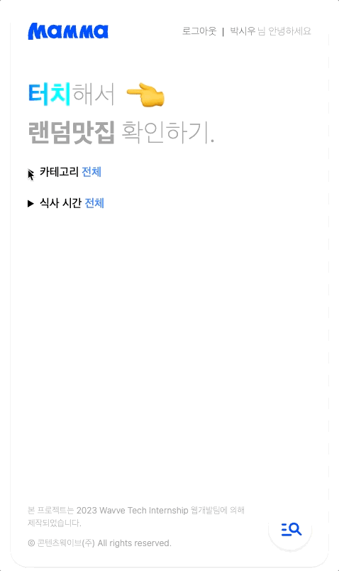
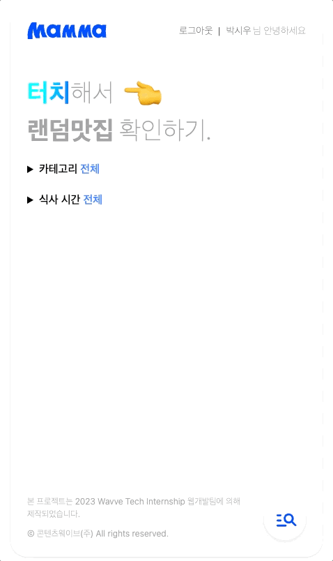
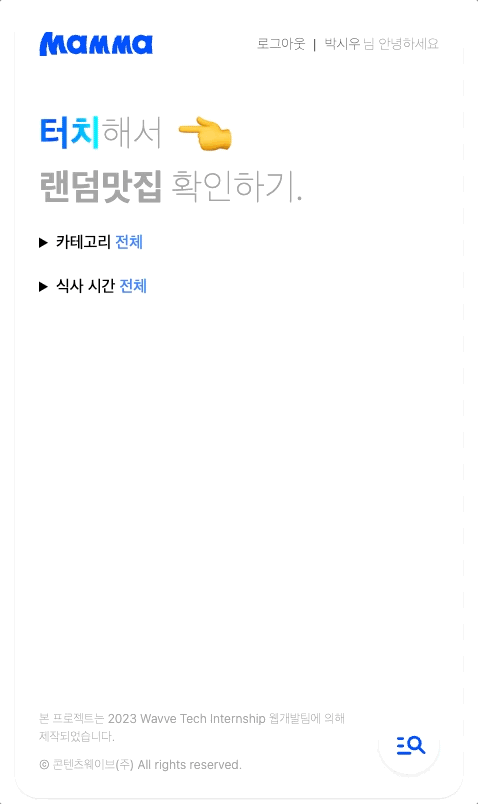
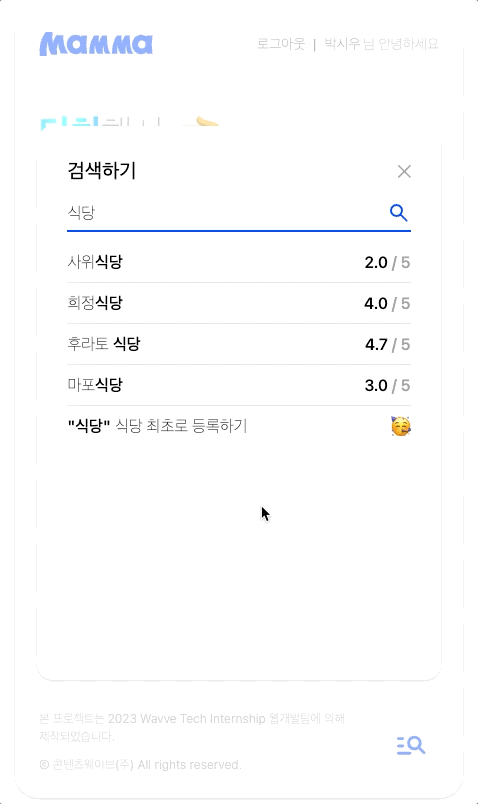
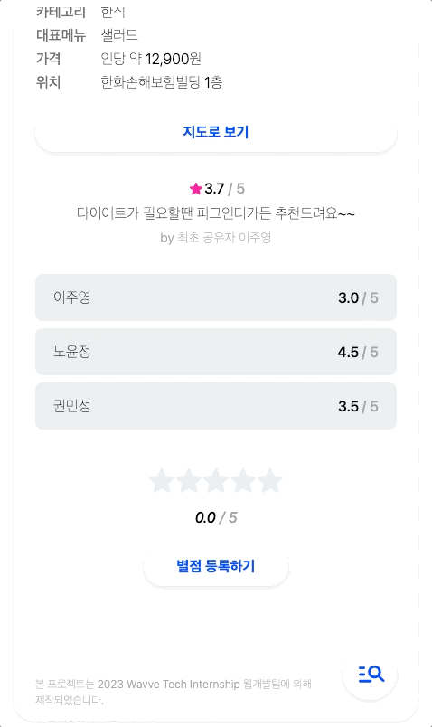

# Mamma - 오늘 점심 뭐 먹지?

  

🌊 Wavvie, 맘마먹자!

Wavve 사내에서 관리되고 있는 **대동맛지도** 기반으로 랜덤하게 점심을 추천해주는 서비스입니다.

**[서비스 링크 🔗](https://mamma.vercel.app/)**

> Wavve 임직원을 위한 서비스로, `wavve.com` 도메인으로만 가입할 수 있습니다. 비 로그인 상태에서도 랜덤 추천 기능은 사용할 수 있습니다.

---

## 구현 기능

<table width="100%">
  <tr>
  <th width="50%">레스토랑 랜덤 추천</th>
  <th width="50%">레스토랑 검색</th>
  </tr>
  <tr>
  <td width="50%">

</td>
  <td width="50%">

</td>
  </tr>
  <tr>
  <td width="50%">필터 조건에 따라 알맞은 레스토랑을 랜덤하게 추천해줍니다. 식당 정보와 리뷰를 볼 수 있습니다.</td>
  <td width="50%">레스토랑을 검색할 수 있습니다.</td>
  </tr>
  <tr>
  <th width="50%">레스토랑 추가 / 삭제</th>
  <th width="50%">리뷰 추가 / 삭제</th>
  </tr>
  <tr>
  <td width="50%">

</td>
  <td width="50%">

</td>
  </tr>
  <tr>
  <td width="50%">레스토랑을 자유롭게 추가 및 삭제할 수 있습니다.</td>
  <td width="50%">레스토랑에 대해 리뷰를 추가 및 삭제할 수 있습니다.</td>
  </tr>
</table>

## Tech

`Vue.js` `Vue Query` `UnoCSS` `TypeScript`

- 테크 인턴십 기간동안 빠르게 Vue.js에 적응하기 위해 웹 인턴이 모여 개발을 시작한 토이 프로젝트입니다.
  - 이후 저와 [@da-in](https://github.com/da-in) 님이 모여 프로젝트를 완성했습니다.
